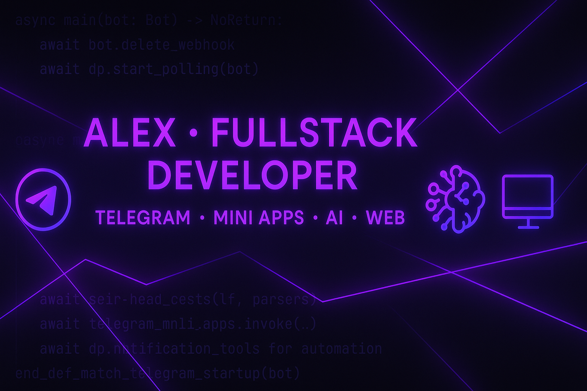

  

<h1 align="center">Hi 👋, I'm Alex</h1>
<h3 align="center">Fullstack Developer · Telegram Bots & Mini Apps · Web Apps · AI</h3>

  
  

  
  
  
  

---

## 🚀 About me

- 🤖 I build **Telegram bots** (AI, parsers, payments, automation)
- 📱 I create **Telegram Mini Apps** with custom UI
- 🌐 I develop **web apps** (TeachAI, dashboards, landing pages)
- 🧠 Working with **LLMs (LLaMA, GigaChat, GPT)** in real projects
- 📫 Contact: **https://t.me/wayzzoo**

---

## 🛠 Tech stack

  

---

## 🔧 What I build

- Telegram bots: education, parsers, notification systems  
- Telegram Mini Apps with custom frontend  
- AI integrations (LLM, prompt analysis, assistants)  
- Web dashboards and internal tools for automation  

---

## 📌 Featured projects

- 🧠 **TeachAI** – Telegram Mini App for learning AI & Python  
- 🤖 **TG-CHAT-BOT-LLM** – LLaMA3-based Telegram bot for prompt training  
- 📊 **tg-parse_test** – Telegram parser / automation tool  

_(see pinned repositories below 👇)_

---
---

<h3 align="center">💬 Open to freelance & collabs (Telegram / Web / AI)</h3>
